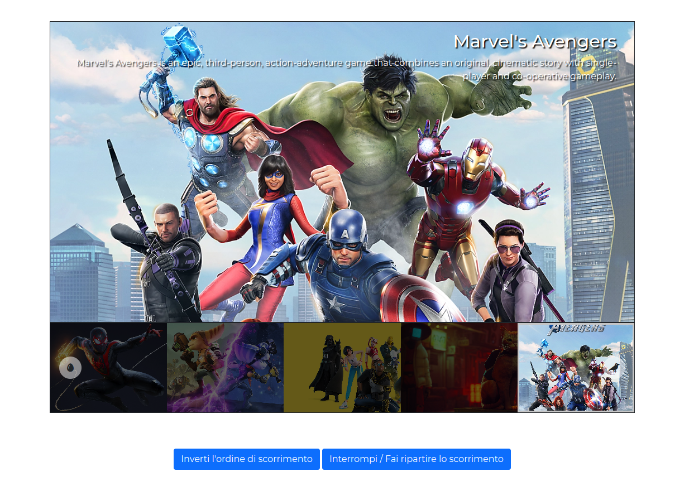

Consegna:
Dato un array di oggetti letterali con:
 - url dell'immagine
 - titolo
 - descrizione 

Creare un carosello come nella foto.

Milestone 1:

- [x] Nel markup allegato rimuoviamo i contenuti statici e usiamo l’array di oggetti letterali per popolare dinamicamente il carosello.

 - [x]Al click dell'utente sulle frecce verso sinistra o destra, l'immagine attiva con i relativi titolo e testo diventerà visibile.

Milestone 2:

- [] Aggiungere il **ciclo infinito** del carosello. Ovvero se la miniatura attiva è la prima e l'utente clicca la freccia verso destra, la miniatura che deve attivarsi sarà l'ultima e viceversa per l'ultima miniatura se l'utente clicca la freccia verso sinistra.